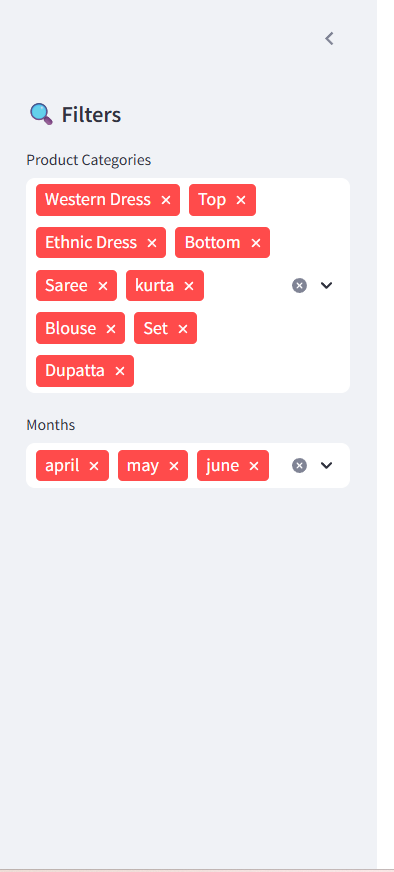

# 📦 Amazon SCM Dashboard – Vendor Analytics & Automation

A data-driven Streamlit dashboard for **Amazon vendors** to analyze sales, product performance, regional trends, and inventory needs.  
This dashboard connects directly to a **MySQL database** and provides an intuitive UI with filtering, forecasting, and visual analytics.

---

## 🚀 Features

- 💰 **Revenue Analysis**: Track total sales, average order value, return/cancellation counts
- 📦 **Product Performance**: Top categories, best-selling sizes, monthly breakdowns
- 🌍 **Regional Insights**: Highest revenue states, category popularity by state
- 🔄 **Inventory Planner**: SKU-level restock recommendation with buffer %
- 🔍 **Sidebar Filters**: Filter data by garment category and selected month
- 📈 **Interactive Visuals**: Plotly and Seaborn-powered charts
- 🧠 **Insight Section**: Key trends extracted from EDA

---

## 🖼 Dashboard Previews

> Add your screenshots to a folder like `/assets/` and rename accordingly.

### 🔍 Sidebar Filters
Filters by product category and month  

---

### 💰 Revenue Analysis
Key KPIs and monthly/daily revenue charts  

---

### 📦 Product Performance
Bar charts by product category and size  

---

### 🌍 Regional Trends
Top-performing states and categories  

---

### 🔄 Inventory Planner
Restock simulator with recommended stock level  

---

## 🧠 Data Insights (from Notebook)

Key insights from `notebooks/amazon-sales-data-analysis.ipynb`:

- **Western Dress** and **Set** dominate revenue share
- Sizes **S, M, and L** drive most orders
- **Business buyers** spend more than regular customers
- **April** leads in revenue vs. May and June
- **Cancellation rate** of 14.22% is significant and actionable

---

## 🛠 Tech Stack

| Layer        | Tech Used |
|--------------|-----------|
| UI & Frontend | Streamlit, Plotly, Matplotlib, Seaborn |
| Backend       | MySQL (via SQLAlchemy + PyMySQL) |
| Data Layer    | Pandas, NumPy |
| Dev Utilities | dotenv, Jupyter Notebook |

---

## 🛣️ Future Scope

- 🤖 AI-based SKU recommendation engine (OpenAI)
- 📈 Time-series forecasting (Prophet/LSTM)
- 🌐 Deploy publicly on Streamlit Cloud or Hugging Face Spaces

---

## 👥 Contributors

- **Ishan Kumar** – [@IshankumarP](https://github.com/IshankumarP)
- **Krithik Raman** – PES1UG22AM087
- **J.O. Shivnesh** – PES1UG22AM073
- **Rahul D** – PES1UG22AM127
